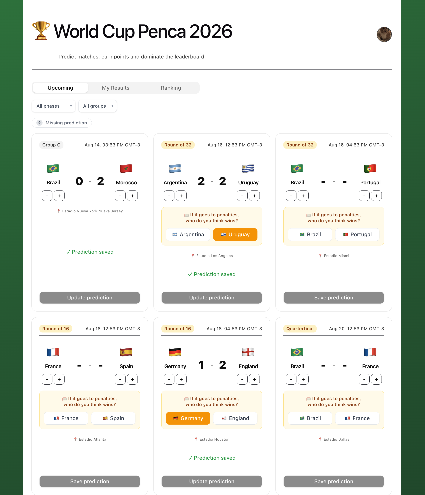
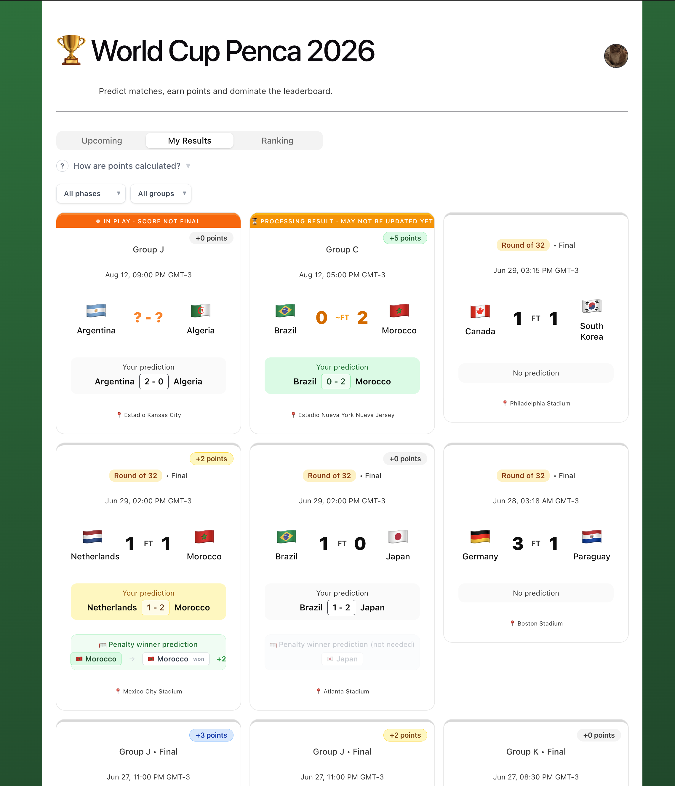
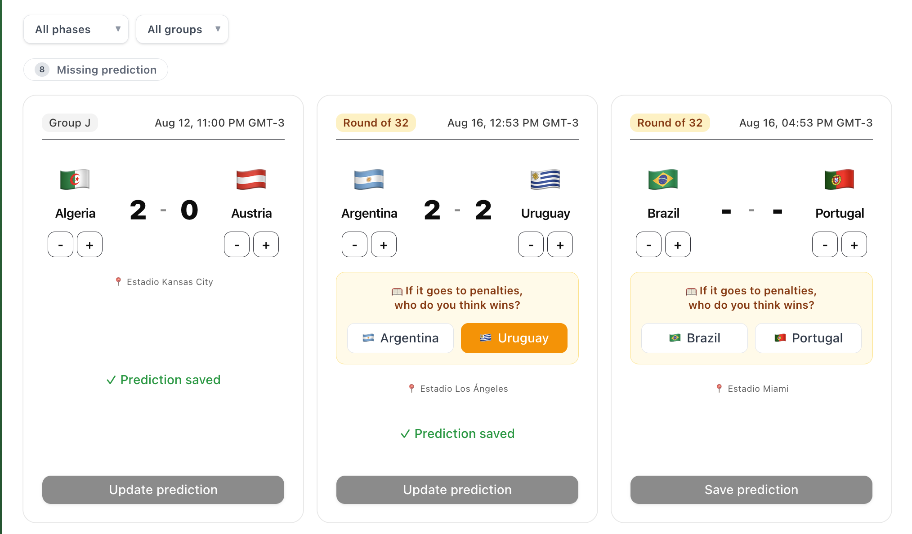
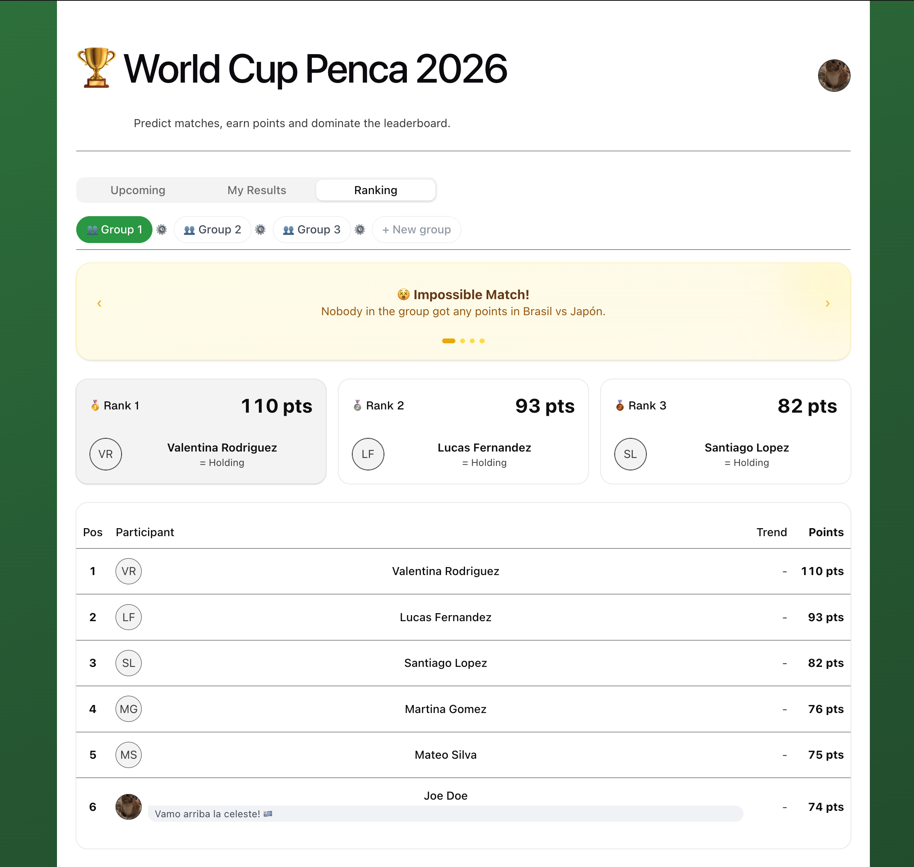
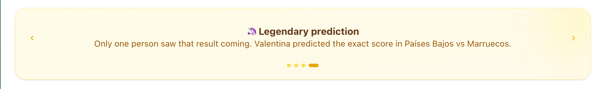
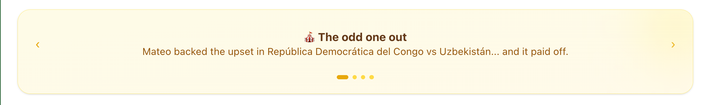
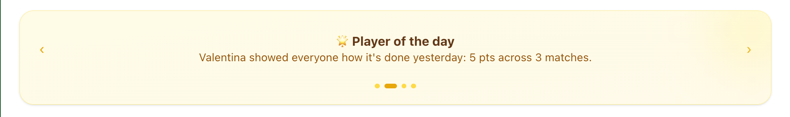

<div align="center">

# 🏆 Penca Mundial

**A full-stack platform for running World Cup prediction pools with friends and family.**

Predict match scores, compete in private groups, climb the leaderboard, and unlock fun automated "awards" after every match.



<video src="https://github.com/user-attachments/assets/b999fa05-6e6a-4862-9399-401b97ef0e88" controls width="280"></video>

</div>

---

## About

Penca Mundial ("penca" is Spanish/Portuguese slang for a friendly betting pool) was built for the 2026 FIFA World Cup. Users sign up, predict the score of every match, and join or create private groups ("pencas") to compete against friends, family, or coworkers on a live-updating leaderboard.

Beyond simple predictions, the app runs a custom scoring engine and an automated highlights system that surfaces fun, data-driven awards after each match — things like who nailed the exact score, who's on a hot streak, and who guessed a truly impossible result.

## Features

- **Match predictions** — pick a score for every match of the tournament, from the group stage through the final.
- **Live scoring** — predictions are automatically scored the moment a match result is confirmed.
- **Play groups** — create private groups, invite people via shareable link, and manage members.
- **Leaderboards** — tournament-wide and per-group rankings, recalculated automatically after every match.
- **Highlights engine** — automated post-match awards generated by a set of custom calculators, including Player of the Day, Winner Guesser, Exact Score Streak, Twins (identical predictions), Impossible Match, and more.
- **Admin panel** — manage matches, teams, stadiums, and manually trigger highlight generation.
- **Authentication** — email/password auth with JWT sessions, password recovery via email, and profile avatar uploads.
- **Multi-language UI** — full Spanish / English support via i18n.
- **Audit trail** — prediction and ranking changes are versioned with PaperTrail.

## Tech stack

**Backend**
- Ruby on Rails 7.1 (JSON API)
- PostgreSQL
- Devise + `devise-jwt` for authentication
- Active Storage for avatar uploads
- PaperTrail for auditing
- Puma, Docker-ready

**Frontend**
- React 19 + TypeScript
- Vite
- Tailwind CSS 4 + shadcn/ui (Radix primitives)
- React Router 7
- React Hook Form
- Axios

## Project structure

```
penca_mundial/
├── app/
│   ├── controllers/api/     # JSON API endpoints (matches, predictions, play groups, admin...)
│   ├── models/              # Tournament, Match, PlayGroup, Prediction, Team, User...
│   ├── services/
│   │   ├── highlights/      # Award calculators (Player of the Day, Twins, Impossible Match...)
│   │   └── predictions/     # Scoring logic
│   └── jobs/                 # Background jobs for scoring & highlight updates
├── frontend/
│   └── src/
│       ├── pages/            # Dashboard, Admin panel, Login, Group predictions...
│       ├── components/       # Match cards, score inputs, sidebar, tabs...
│       └── services/         # API clients
└── Dockerfile
```

## Getting started

### Prerequisites

- Ruby 3.2.1
- Node 18+
- PostgreSQL
- Bundler / npm

### Backend setup

```bash
bundle install
rails db:setup
rails server
```

Create a `.env` file in the project root with:

```
FRONTEND_URL=http://localhost:5173
GMAIL_USERNAME=your_gmail_address
GMAIL_PASSWORD=your_gmail_app_password
```

(`GMAIL_USERNAME` / `GMAIL_PASSWORD` are used to send password-reset emails.)

### Frontend setup

```bash
cd frontend
npm install
npm run dev
```

The frontend runs on `http://localhost:5173` and expects the Rails API on the port configured in `frontend/.env.development`.

### Docker

A production-ready `Dockerfile` is included:

```bash
docker build -t penca-mundial .
docker run -p 3000:3000 penca-mundial
```

## Screenshots

| | |
|---|---|
|  |  |
| Dashboard | Match predictions |


*Group leaderboard*

### Post-match highlights







## License

No license has been set yet — add one (e.g. MIT) if you'd like others to reuse this code.
